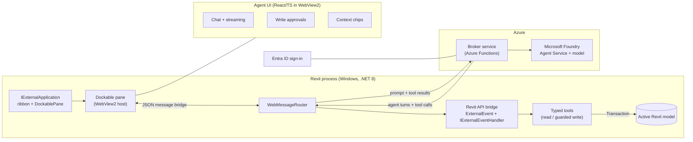
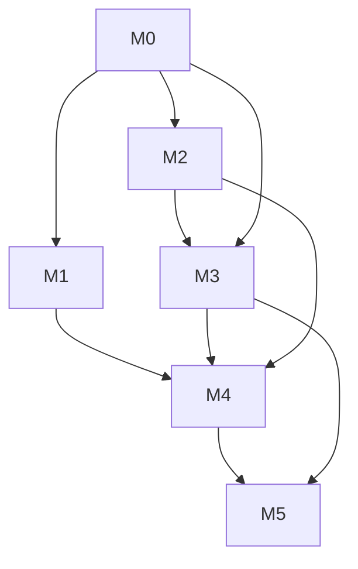

# AI Assistant Extension for Autodesk Revit — Plan

> An in-application AI agent for Autodesk Revit. A companion agent UI docks alongside the
> Revit modeling environment — mirroring how GitHub Copilot for Xcode runs an agent UI
> parallel to the IDE — and reasons via a model hosted in **Microsoft (Azure AI) Foundry**,
> reading and acting on the active Revit model through the Revit API.
>
> This project is **not** built on GitHub Copilot. Copilot for Xcode is referenced only as a
> UX precedent for how an agent surface runs parallel to a host application.

---

## 1. Vision

Give Revit users a conversational, agentic assistant embedded in the Revit UI that can:

- Answer questions about the open model (quantities, categories, parameters, views, levels).
- Explain and locate elements ("where are the non-load-bearing walls on Level 2?").
- Perform **guarded, reversible edits** on request (set parameters, place simple elements),
  always inside a named Revit transaction so native Undo works.
- Keep the human in control: every write is previewed and explicitly approved.

The interaction model mirrors Copilot for Xcode: an always-available companion pane with a
chat transcript, streaming responses, tool/at-work indicators, and an "actions taken" list.

---

## 2. Key constraints & findings

| # | Constraint | Consequence for design |
|---|------------|------------------------|
| C1 | **Revit is Windows-only** (no macOS build). | Target Windows / .NET. "Cross-platform" is served by a portable web UI, not a Mac build. |
| C2 | **Revit API is single-threaded and context-bound.** API calls are valid only inside a Revit API context. | A modeless/dockable UI **must** marshal every read/write back to Revit's main thread via `ExternalEvent` + `IExternalEventHandler`. This is the #1 architectural rule. |
| C3 | **Revit API is versioned yearly.** 2025+ is .NET 8; 2024 and earlier are .NET Framework 4.8. | Per-Revit-version build matrix. MVP targets 2025/2026 (.NET 8) only. |
| C4 | **Copilot-for-Xcode UX** uses an out-of-process companion because Xcode lacks a real extension API. | Revit exposes first-class `DockablePane` + add-in APIs, so we achieve the same "parallel agent UI" **in-process** — cleaner and simpler. |
| C5 | **Foundry** exposes models/agents via a unified project endpoint + Responses API (Agents v2), C# SDK `Azure.AI.Projects`, Entra ID auth, and function-calling tools. | Cloud agent can drive multi-step behavior; tools execute locally in the add-in. |
| C6 | **Secrets must not ship in a desktop binary.** | A thin cloud **broker** holds Foundry credentials and brokers requests; the add-in authenticates the user via Entra ID. |

---

## 3. Architecture



**Component responsibilities**

- **Revit add-in host** (`IExternalApplication`) — registers the ribbon button and the
  dockable pane; owns the process lifetime. In-process (unlike Xcode's separate app).
- **Agent UI (WebView2)** — a portable React/TS web app in the pane. Themeable, reusable in a
  future standalone window. Talks to C# over the WebView2 message bridge.
- **Revit API bridge** — `IExternalEventHandler` implementations behind an `ExternalEvent`
  queue. The **only** place the Revit API is touched outside a command. All model reads and
  writes flow through here on the main thread.
- **Typed tools** — read ops (selection, elements by category/param, views, levels, model
  info) and guarded write ops (set params, place simple elements) inside `Transaction`s.
- **Broker service** (Azure Functions) — holds Foundry credentials, brokers Responses API
  calls, keeps secrets out of the desktop binary.
- **Foundry Agent Service** — hosts the model and the agent; Revit tools are exposed as
  function-calling tools; the local add-in executes them and returns results.

**Data / control flow for one agentic turn**

1. User types a prompt in the pane (optionally attaching context chips: selection, active view).
2. WebUI → `WebMessageRouter` → broker → Foundry Agent Service.
3. Agent responds with text and/or a **tool call** (e.g. `set_parameter`).
4. Broker relays the tool call back to the add-in.
5. Add-in enqueues an `ExternalEvent`; the handler runs the tool on Revit's main thread
   (reads immediately; writes only after user approval, inside a named `Transaction`).
6. Tool result returns up the chain; the agent continues until the turn completes.

---

## 4. MVP scope

**In scope**

- Revit **2025 and 2026** only (.NET 8).
- Dockable companion pane with WebView2-hosted React UI.
- Conversational chat with streaming responses and cancellation.
- **Read tools:** current selection, element details/parameters, elements by category,
  list levels/views, basic model summary and quantity takeoff.
- **Guarded write tools:** set an instance/type parameter on selected elements; place a
  family instance at a point. Every write is previewed, approved, and wrapped in one named
  transaction (native Undo reverts it).
- Context chips: current selection, active view, active document.
- Entra ID user sign-in; all Foundry traffic via the broker (no secret in the add-in).
- Action log of everything the agent did.

**Out of scope for MVP** (see §9 roadmap)

- Revit 2024 / .NET Framework support.
- Complex authoring (system routing, families creation, sheets/annotation automation).
- Multi-document / linked-model operations.
- Offline / local model inference.
- Team/collaboration features, telemetry dashboards.

**MVP acceptance scenario**

> User selects several walls, types *"set Fire Rating to 2 hr on the selected walls."*
> The agent proposes the change, the user approves, the add-in applies it in a single named
> transaction, the pane shows it in the action log, and Revit's native **Undo** reverts it.

---

## 5. MVP development plan

Estimated as ordered workstreams. Each milestone has an exit gate that must pass before the
next begins. Spikes (M0) exist to kill the riskiest assumptions first.

### M0 — Spikes / de-risking (do these first, in parallel where possible)

| Task | Description | Exit gate |
|------|-------------|-----------|
| S0.1 | Scaffold minimal add-in: `.addin` manifest + `IExternalApplication` adding a ribbon button and an empty `DockablePane`. | Button appears in Revit 2025 & 2026; empty pane docks. |
| S0.2 | `ExternalEvent` + `IExternalEventHandler` spike: read current selection + element params on the main thread, return to caller. | Selecting elements and clicking the button returns correct element data. |
| S0.3 | WebView2-in-pane spike: render a placeholder web app and round-trip a JSON message C# ↔ JS. | Message sent from JS is received in C# and echoed back. |
| S0.4 | Foundry call spike from C# (`Azure.AI.Projects`, Responses API) returning a completion. | A prompt returns a model completion using Entra auth. |

**M0 exit gate:** all four spikes green. The threading model (C2), UI host (C4), and Foundry
path (C5) are proven independently.

### M1 — Add-in skeleton & UI host

- Productionize S0.1/S0.3 into the real project structure (below).
- Dockable pane hosts the React UI (dev-served in debug, bundled in release).
- Robust WebView2 message router with typed request/response envelopes and error surfacing.
- App lifecycle: pane open/close, Revit doc open/close events wired to UI state.

**Exit gate:** open Revit → open pane → React UI loads → send/receive typed messages reliably.

### M2 — Revit API bridge & tool surface

- Build the `ExternalEvent` queue and a dispatcher mapping tool names → handlers.
- Implement **read tools**: `get_selection`, `get_element_details`, `get_elements_by_category`,
  `list_levels`, `list_views`, `get_model_summary`.
- Implement **guarded write tools**: `set_parameter`, `place_family_instance` — each wrapped in
  a named `Transaction` with validation and rollback on error.
- Enforce: no Revit API access anywhere except inside handlers on the main thread.

**Exit gate:** each tool callable from a test harness returns correct results; a write applies
in one transaction and is revertible with native Undo.

### M3 — Foundry agent integration

- Broker service (Azure Functions): authenticated relay to Foundry Responses API; holds
  credentials; exposes a minimal `/turn` and streaming endpoint.
- Register the Revit tools as Foundry function-calling tools (schemas mirror M2 signatures).
- Local dispatch loop: agent tool call → broker → add-in `ExternalEvent` → tool result → agent.
- Conversation state manager: thread lifecycle, streaming tokens, cancellation.

**Exit gate:** a read-only prompt ("how many doors are on Level 1?") completes end-to-end via
the cloud agent and returns a correct, model-grounded answer.

### M4 — Agent UI (Copilot-for-Xcode-style)

- Chat transcript with streaming tokens and stop/cancel.
- Tool-call / "at work" indicators and an **actions taken** list.
- **Write approval UX**: inline preview of the proposed change with Approve / Reject; nothing
  writes without approval.
- **Context chips**: attach current selection / active view / document to a prompt.

**Exit gate:** the MVP acceptance scenario (§4) passes through the real UI.

### M5 — Security, auth, packaging

- Entra ID sign-in in the add-in; tokens stored via Windows DPAPI / credential locker
  (never plaintext). All Foundry traffic via the broker.
- Guardrails: validate/scope every agent-driven write; confirm destructive ops; treat LLM
  output as untrusted before it drives API calls; log all actions.
- Packaging: bundle add-in + `.addin` manifest to
  `%ProgramData%\Autodesk\Revit\Addins\<version>\`; WebView2 runtime dependency check;
  MSI/installer; separate build outputs for Revit 2025 and 2026.

**Exit gate:** clean install on a fresh machine for both Revit versions; no Foundry secret in
shipped binaries; writes require approval; actions are logged.

### Dependency graph



---

## 6. Proposed project structure

```
revit-ai-extension/
├─ docs/
│  └─ PLAN.md                      # this document
├─ src/
│  ├─ RevitAddin/                  # C# add-in (net8.0-windows; per-version builds)
│  │  ├─ Application.cs            # IExternalApplication: ribbon + DockablePane
│  │  ├─ AgentDockablePane.cs      # IDockablePaneProvider hosting WebView2
│  │  ├─ Bridge/
│  │  │  ├─ RevitActionHandler.cs  # IExternalEventHandler + ExternalEvent queue
│  │  │  └─ WebMessageRouter.cs    # WebView2 <-> C# JSON routing
│  │  ├─ Foundry/
│  │  │  └─ FoundryAgentClient.cs  # talks to broker; tool dispatch loop
│  │  ├─ Tools/                    # typed read/write tool implementations
│  │  └─ RevitAiAssistant.addin    # add-in manifest
│  ├─ WebUI/                       # React/TS agent UI (chat, streaming, approvals, chips)
│  └─ BrokerService/               # Azure Functions: Foundry token/relay broker
└─ README.md
```

---

## 7. Key risks & mitigations

| Risk | Impact | Mitigation |
|------|--------|-----------|
| Threading violations (calling API off-context) | Crashes / corrupt model | Single `ExternalEvent` chokepoint; code review rule; a debug assert that fails any off-thread API access. Proven in S0.2 before anything else. |
| Agent makes an incorrect/destructive edit | Damaged model, lost trust | All writes previewed + approved; named transactions; native Undo; destructive-op confirmation; validation in tools. |
| Foundry latency / streaming stalls | Poor UX | Streaming responses, cancellation, optimistic "at work" indicators, timeouts. |
| Secret leakage in desktop binary | Credential compromise | Broker holds credentials; add-in uses per-user Entra tokens only. |
| Revit version API drift | Build breakage | Per-version build matrix; isolate version-specific code; smoke-test both targets. |
| WebView2 runtime missing on user machine | Add-in won't render UI | Installer dependency check + guided install of the Evergreen runtime. |

---

## 8. Security checklist (MVP)

- [ ] No Foundry/Azure secret in the shipped add-in; broker holds all credentials.
- [ ] User auth via Entra ID; tokens stored with DPAPI/credential locker, never plaintext.
- [ ] Broker validates the caller and scopes access; no wildcard CORS with credentials.
- [ ] LLM output treated as untrusted; validated/whitelisted before it drives any API call.
- [ ] Every write requires explicit user approval and runs in a named, revertible transaction.
- [ ] Destructive operations require a second confirmation.
- [ ] All agent actions logged (no secrets/PII in logs).

---

## 9. Post-MVP roadmap (not committed)

- Revit 2024 / .NET Framework 4.8 support; broader version matrix.
- Richer authoring tools (systems, sheets, annotations, family creation).
- Multi-document and linked-model awareness.
- Standalone companion window reusing the same web UI.
- Team features, usage analytics, and continuous evaluation of agent quality in Foundry.
- Local/offline model option for sensitive projects.

---

## 10. Decisions (baked into this MVP)

1. **In-process dockable pane** (not an out-of-process companion like Xcode) — Revit's docking
   and add-in APIs make it cleaner while preserving the "agent UI parallel to the app" UX.
2. **WebView2 web UI** over native WPF — portability, theming, and future standalone reuse.
3. **Foundry Agent Service with local tool execution** over a client-only completion loop.
4. **Windows-only, .NET 8, Revit 2025/2026** for MVP.
5. **Cloud broker from day one** — best security posture; no secret in the desktop binary.
6. **Read + guarded writes** for MVP scope, everything gated behind explicit approval.
```